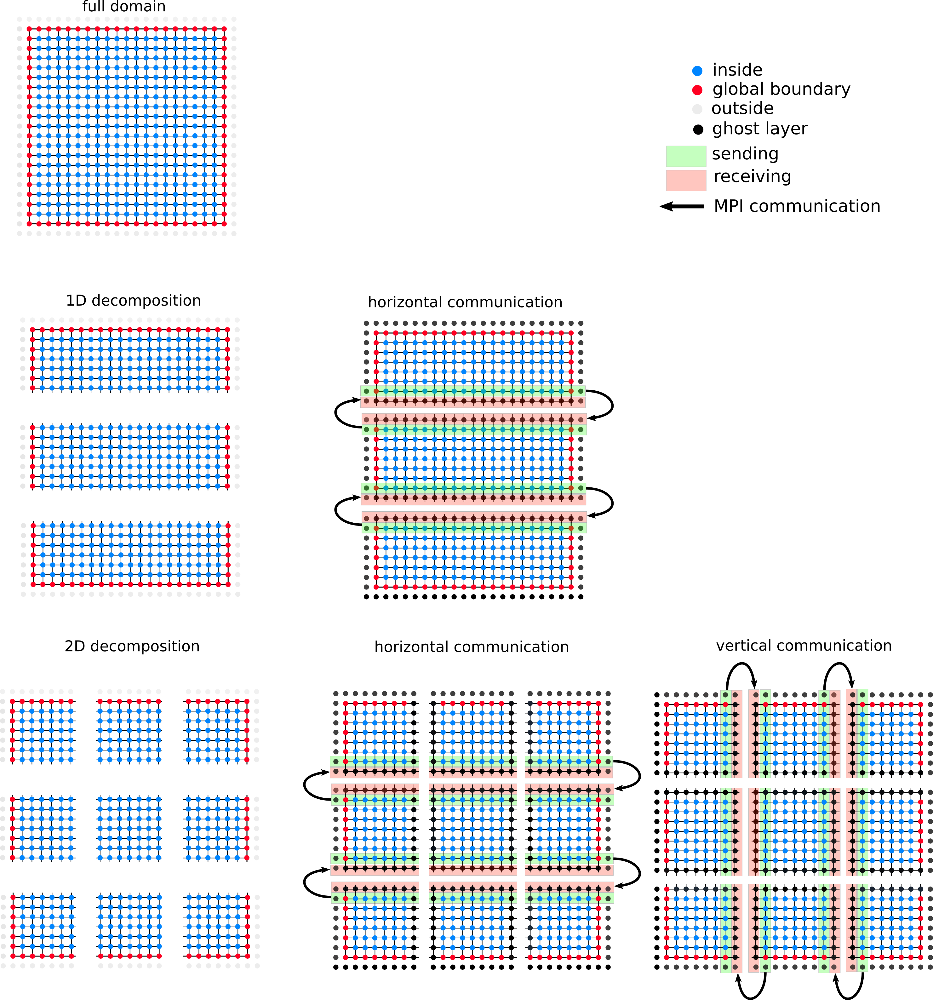

# Task 1

## 1. Describe the advantages/disadvantages of a two-dimensional decomposition (compared to a one-dimensional decomposition).

more parallelization, symmetric matrices not rectangle maybe better?

## 2. Discuss if the decomposition of the domain changes the order of computations performed during a single Jacobi iteration (i.e., if you expect a numerically identical result after each iteration, or not).

## 3. A generalization of the ghost layer approach would be to set the width of the ghost layer that is exchanged as a parameter W of the decomposition. This allows to perform W independent iterations before a communication of the ghost layers has to happen. Comment in which situation (w.r.t the available bandwidth or latency between MPI-processes) multiple independent iterations are potentially advantageous.

## 4. Assume a ghost layer with width W=1 (this is what you will later implement) and discuss if a data exchange between parts of the domain which are "diagonal neighbors" is required assuming a "5-point star-shaped stencil".

nicht direkt glaube ich, wenn bei 2d indirekt die Werte am jeweiligen eck durch horizontal und dann vertical bekommt diagonal element einen wert kommuniziert. Dieser würden den Wert aber eigentlich nicht brauchen. 

 

## 5. How big is the sum of all L2 caches for 2 nodes of the IUE-cluster 

L2 (Level 2) cache is slower than the L1 cache but bigger in size. Where an L1 cache may measure in kilobytes, modern L2 memory caches measure in megabytes.
https://www.makeuseof.com/tag/what-is-cpu-cache/

Regular compute node (10x): 
2x INTEL Xeon Gold 6248, 2.5GHz, 20C/40T
Fat compute node (2x): 
2x INTEL Xeon Gold 6248, 2.5GHz, 20C/40T
https://www.iue.tuwien.ac.at/research/computing-infrastructure/

--> ein INTEL Xeon Gold 6248, 2.5GHz hat L2 cache von 16.0 MB
https://www.cpubenchmark.net/cpu.php?cpu=Intel+Xeon+Gold+6248+%40+2.50GHz&id=3517

Also for 2 nodes und je 2 INTEL = 4*16 = 64MB